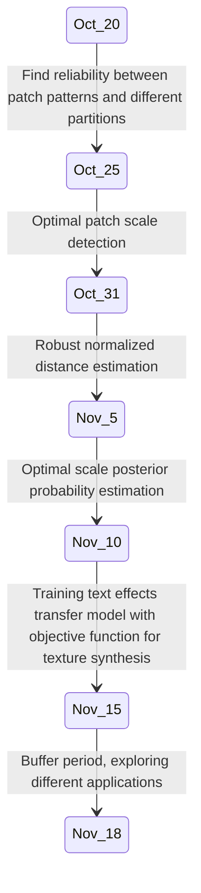

# Digital Image Processing - Project Proposal

### Project Title
<b>Awesome Typography: Statistics-Based Text Effects Transfer</b>

---
#### Project ID : 33

#### Team Name : 255 Shades of Gray

#### Team Number : 35

#### Git link
https://github.com/Digital-Image-Processing-IIITH/project-255-shades-of-gray

### Team Members
 * Nihar Potturu - 2018102039
 * Abhiram Bondada - 2018102036
 * Tushar Patra - 2018102041
 * Samartha S M - 2018101094

---
## Main goal(s)
* Generate fantastic special-effects for the typography
* Accomplish adative multi-scale texture synthesis
* Make style element distribution uniform
* Achieve similar local texture patterns and global spatial distribution in target text image similar to source stylized image

---
## Project Definition
### Problem Statement
Generating text effects for producing artistic typography

### Problem Domain
Style Transfer 

### Necessity
Rendering the same typography – special effects by human methods requires lots of editing skills to create a visually plausible outputs. This method allows automatic transfer of various fantastic text effects onto plain texts.

### Image processing techniques used
* **Color transfer** : matching global and/or local color distributions of target and source images
* **Texture transfer** : Guidance image constrained texture synthesis using parametric and non-parametric methods.
* **Skeletonization**

### Proposed Method 

Arbitrary text effects transfer is challenging due to variety of text effects, the complex composition of sub-effects and the simpleness of guidance maps.

Observation - Patch patterns are highly dominated by their locations (spatial distribution) i.e., patch patterns at similar locations tend to have similar patterns.

**Pixel color** and **patch scale** are used as two factors for representation of pattern of patch.

#### 1. Problem Formulation and Analysis

* Divide text effects image into N partitions. As modes of partition are extremely diverse, compare five typical partition modes (**random, grid, angle, ring, distance**)

* Calculate average patch difference between all patches in a partition and their best matches on same image (**response curve** of scale). This gives N response curves for N partitions with same partition mode
* To compare reliability of partition modes, two terms are used
    * **inter curve standard deviation**: average of scale-wise standard deviations of average responses at same partitions
    * **intra curve standard deviation**: average of point-wise standard deviations for all scales and partitions

 

#### 2. Text Effects Statistics Estimation
* **Optimal patch scale detection**
Picking the best scale for a patch in source image by screening patches. It is found that the textured region near the character requires finer patch scales than the outer flat region.
 
* **Robust normalised distance estimation**
Custom Distance transform on the skeleton of text image, normalised w.r.t text width (for class partition). It can be seen as follows,
 

* **Optimal Scale Posterior Probability Estimation**
Dividing distances into uniformly quantified bins, finding posterior probability (as calculated from source image) for scale of a patch given distance (from the bins) - for formulating the optimization problem in the next stage.

#### 3. Text Effect Transfer
**Optimization Problem** 
Minimizing an objective function and solving texture transfer as an optimization problem is used achieve the text effect transfer - done using probability values previously calculated.  
Our three main objectives are reflected in the objective function in the following ways,
* **Appearance Term** : **Texture Style Transfer**:
    Preserves coarse grained texture structures and texture details
* **Distribution Term** : **Spatial Style Transfer**:
    Ensures similar distribution of sub-effects in the target and source images
* **Psycho- Visual Term** : **Naturalness Preservation**: 
    Penalizes texture over-repetitiveness and encourage new texture creation.

### Results of the project

Given the **source plain** text image, **source stylized** text image and **target plain** text image, we want to obtain **target stylized** text image.

---
## Tentative Project Timeline

---
## Data set acquisition
A Data set link is provided in the paper. Also we plan to use the Word Art text styles present in MS Office tools for testing the text effects results.

---